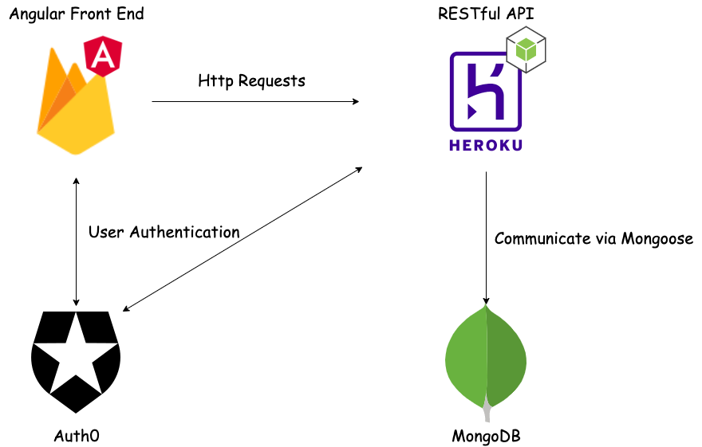

# PIphone
* Architecture Overview

* This page is hosted on https://pigeon-phone.web.app

# Features
* User login via Auth0
* Create a 4-digit pin for your pigeon-phone
* AES encryption on the 4-digit pin
* Unlock your pigeon-phone
* (Upcoming) Create notes in the Notes App and share your pigeon-phone with others to allow them see the notes. Recipients need to have the 4-digit pin.

* The purpose of this project is to experience fullstack web development and experiment cloud technologies.

* Huge thanks to the authors on codepen. I have referenced them directly in .scss files.

* Please view README.md without Dark Mode on.
